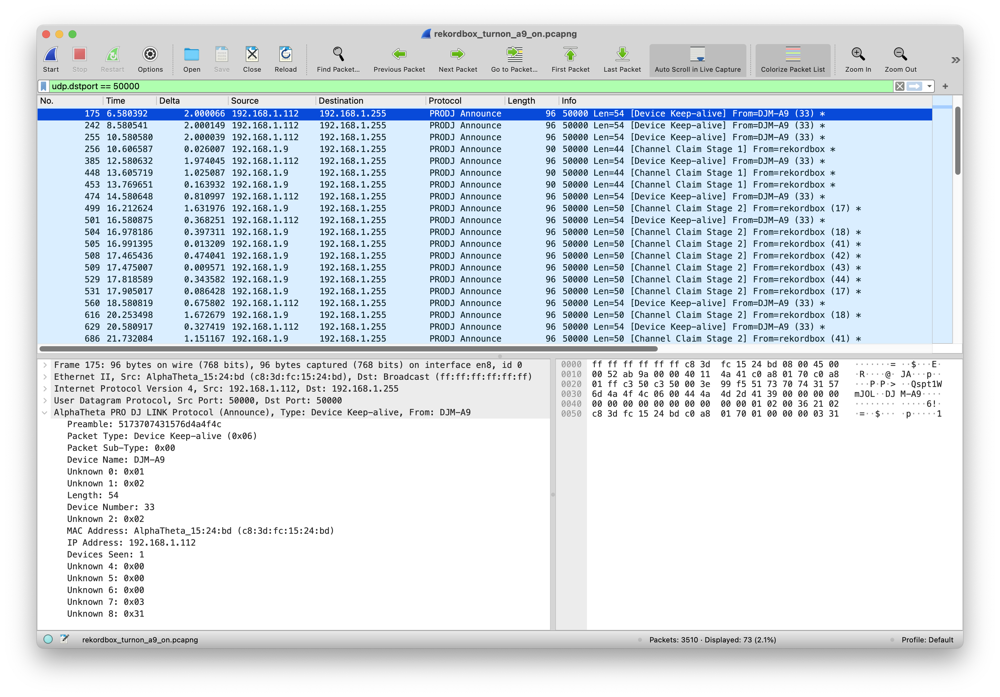
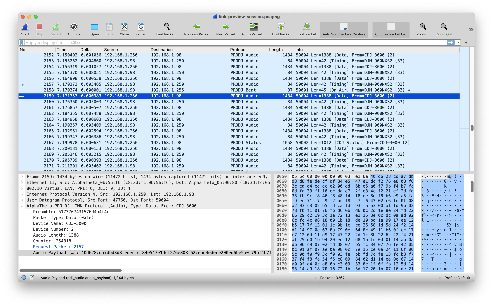

# wireshark-prodj-dissectors
Wireshark Dissectors for PRO DJ LINK protocol

Based on the awesome [dysentery](https://github.com/Deep-Symmetry/dysentery) project and community.

## Install

Copy all `.lua` files to:

- (Windows)      `%APPDATA%\Wireshark\plugins\`
- (Linux)        `$HOME/.wireshark/plugins`
- (Mac)          `$HOME/.config/wireshark/plugins` (you may need to create the `plugins` folder).
                  If the `wireshark` directory doesn't exist in `.config`, try `$HOME/.wireshark/plugins` instead —
                  both paths may work depending on your Wireshark version.

## Screenshots

## Contributions

Contributions are welcome!

